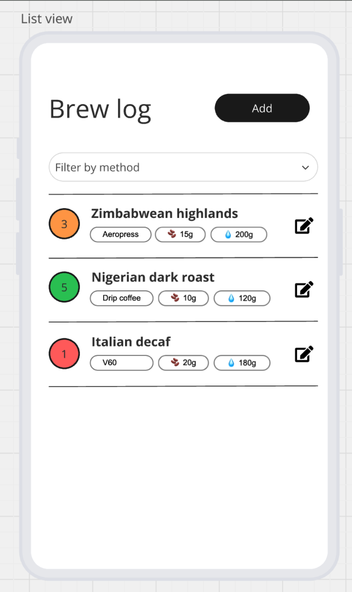

# Crema

**A brew log for people who take coffee seriously.**

Log every brew, spot what actually made it good, and let a coach that has read
your whole log tell you what to change next time.

Built by [Tumo Mogame](https://github.com/TUMO-MOGAME) for the XPL full-stack
developer bootcamp assessment. The brief is preserved verbatim in
[docs/assessment-brief.md](./docs/assessment-brief.md).

> **Current state: Phase 0 of 8 — foundation.** The monorepo, contract package,
> API shell, tooling and quality gates are in place. The brew CRUD feature work
> begins in Phase 3. [STATUS.md](./STATUS.md) is kept current and is the honest
> answer to "how far along is this".

---

## What it does

A micro-roastery brew log. Record what you brewed, how you brewed it, and how it
tasted; then find the pattern in it.

- Create, read, update and delete brew entries
- Filter the log by brew method
- See the water-to-coffee ratio computed for every brew
- **Quick Log** — type
  `18g Ethiopian through the V60, 300 water, blackcurrant, solid 4` and get a
  validated, pre-filled form back
- **Brew Coach** — ask "what ratio gives me my best V60s?" and get an answer
  from your own data, with the agent's reasoning steps shown

The two AI features are optional at runtime. With no API key configured they
disable themselves cleanly and everything else works exactly as before.

## Screens

| List view                                     | Add and edit                                        |
| --------------------------------------------- | --------------------------------------------------- |
|  |  |

## How it is put together

Three decisions shape everything else.

**One contract, two consumers.** [`shared/`](./shared) holds one Zod schema per
concept. The backend parses request bodies with it; the frontend drives its
forms with it and infers its TypeScript types from it. Change the contract and
both sides fail to compile in the same commit, so the API and the client cannot
drift apart.

**Persistence is an implementation detail.** Route handlers call services,
services call a `BrewRepository` interface, and an adapter behind that interface
talks to storage. An in-memory adapter runs the app today; a Drizzle adapter
over Supabase Postgres is written against the same contract test suite and
switches on with one environment variable. The full schema already exists as
reviewed migrations in [`supabase/migrations/`](./supabase).

**The AI proposes, the human commits.** Nothing the model produces is ever
written to the database directly. Quick Log opens a pre-filled form you confirm.
The coach's `proposeBrew` tool emits a candidate, not a record. This is a design
position, not a limitation.

Full reasoning, including the decisions that were rejected and why, is in
[PLANNING.md](./PLANNING.md).

## Stack

|              |                                                                              |
| ------------ | ---------------------------------------------------------------------------- |
| **Frontend** | React 19, Vite, TypeScript, Tailwind CSS v4, TanStack Query, React Hook Form |
| **Backend**  | Hono, TypeScript, Zod                                                        |
| **Database** | Supabase Postgres via Drizzle ORM (schema shipped, connection deferred)      |
| **AI**       | Vercel AI SDK with Google Gemini                                             |
| **Testing**  | Vitest, React Testing Library, Playwright                                    |
| **CI/CD**    | GitHub Actions — nine stages, protected `main`                               |
| **Hosting**  | Vercel, two projects from this one repository                                |

## Quick start

Requires **Node 24** and npm 11. If you use `nvm`, `nvm use` reads the pinned
version from `.nvmrc`.

```bash
git clone https://github.com/TUMO-MOGAME/crema.git
cd crema

npm install
cp .env.example .env      # the defaults work as-is; no database or API key needed

npm run dev
```

- Web — <http://localhost:5173>
- API — <http://localhost:3000/api/health>

No database to provision and no API key to obtain. The app runs on the in-memory
adapter out of the box, which is deliberate: a reviewer should be able to clone
and run in under a minute.

Longer setup notes, including how to connect Supabase and enable the AI
features, are in [Documentation.md](./Documentation.md).

## Scripts

Run from the repository root.

| Command                 | What it does                                 |
| ----------------------- | -------------------------------------------- |
| `npm run dev`           | Frontend and backend together, both watching |
| `npm run build`         | Production build of every workspace          |
| `npm test`              | Unit and integration tests                   |
| `npm run test:coverage` | The same, with coverage thresholds enforced  |
| `npm run lint`          | ESLint across the monorepo, type-aware       |
| `npm run typecheck`     | `tsc --noEmit` per workspace                 |
| `npm run format`        | Prettier, write                              |
| **`npm run verify`**    | **Everything CI runs, in one command**       |

`npm run verify` is the gate. If it is green locally, CI will be green too.

## Layout

```
frontend/     React SPA
backend/      Hono JSON API
shared/       Zod schemas and types imported by both
supabase/     Ordered SQL migrations and seed data
docs/         Brief, architecture notes, decision records
```

## Configuration and secrets

Every value is read from the environment through a Zod-validated loader
([`backend/src/config/env.ts`](./backend/src/config/env.ts)) that fails at boot
with a readable message rather than surfacing an `undefined` mid-request.

Nothing sensitive is committed. `.env` is git-ignored, `.env.example` documents
every variable, and CI runs `gitleaks` across the **full history** on every push
— so a secret committed and later deleted still fails the build.

`GEMINI_API_KEY` is read on the backend only and is never sent to the browser.
Anything behind Vite's `VITE_` prefix is compiled into the client bundle and is
treated as public by definition.

### What v1 does not protect

There is no authentication, and that is a deliberate scope decision rather than
an omission — but it has a consequence worth stating plainly rather than leaving
to be discovered.

**Every brew is readable, editable and deletable by anyone who can reach the
API.** There are no accounts, so there is no such thing as another user's data
to leak; there is also nothing stopping a stranger from emptying the log. The
schema is ready for accounts — `brews.user_id`, the `profiles` table, and row
level security policies on every table in
[`0007_rls.sql`](./supabase/migrations/0007_rls.sql) — but none of it is
load-bearing yet, because the API connects with a role that bypasses RLS.

What does exist is damage control rather than access control:

| Control               | What it stops                                       |
| --------------------- | --------------------------------------------------- |
| Per-caller rate limit | A runaway client or a retry storm                   |
| 16 KB body limit      | A single request exhausting a function's memory     |
| CORS allowlist        | A browser on another origin calling the API for you |
| Strict schemas        | Unknown fields, mass assignment, malformed input    |

So: **do not put a public deployment of v1 in front of data you would mind
losing.** Either keep the deployment private — Vercel's password protection is
enough — or wait for Supabase Auth, which is what turns the auth-ready schema
above into real accounts.

## Quality gates

Nine CI stages run on every push and pull request. Eight in parallel, plus an
aggregate check that branch protection points at:

lint and format · typecheck · unit tests · API tests · database · security ·
build · end-to-end · **CI**

The database stage applies every migration to a real Postgres 17, seeds it, then
proves the constraints reject what they claim to and that the Drizzle schema has
not drifted from the SQL. Coverage thresholds are enforced at 80% lines and 75%
branches. `gitleaks` scans the **full git history** rather than the diff, so a
secret committed and later deleted still fails the build. The bundle has a gzip
size budget. Details in [Documentation.md](./Documentation.md#10-the-pipeline).

## Meeting the brief

| Requirement                                  | Where                                                                 |
| -------------------------------------------- | --------------------------------------------------------------------- |
| Create, read, update, delete a brew          | Phase 3–4                                                             |
| Filter list view by brew method              | Phase 4                                                               |
| Frontend and backend in their own folders    | [`frontend/`](./frontend), [`backend/`](./backend)                    |
| CSS framework                                | Tailwind CSS v4                                                       |
| ORM over a SQL database                      | Drizzle ORM over Supabase Postgres                                    |
| JSON API with CRUD at `/api/brews`           | [PLANNING.md §4.4](./PLANNING.md#44-api-surface)                      |
| Correct HTTP status codes                    | Same table, tested per row                                            |
| Server-side validation of every field        | [`shared/src/brew.ts`](./shared/src/brew.ts)                          |
| Forms blocked on blank fields                | Same schema, client side                                              |
| Page title `Brews: {brewCount}`              | [`use-document-title.ts`](./frontend/src/hooks/use-document-title.ts) |
| Responsive UI                                | Phase 4                                                               |
| No hardcoded secrets, `.env.example` present | [`.env.example`](./.env.example)                                      |
| `Documentation.md`                           | [Documentation.md](./Documentation.md)                                |
| `deployment.md`                              | [deployment.md](./deployment.md)                                      |
| Tidy git history                             | Conventional Commits, enforced by a `commit-msg` hook                 |

Live progress against all of it: [STATUS.md](./STATUS.md).

## What I would build next

Named deliberately, because knowing what you did not build matters as much as
knowing what you did:

- Supabase Auth, turning the auth-ready schema into real multi-user accounts
- Bean and roaster entities, so the same coffee can be tracked across brews
- Charts over the flavour-tag data — which descriptors correlate with a 5
- Offline-first capture with background sync, for logging in a kitchen with no
  signal

## Licence

MIT
