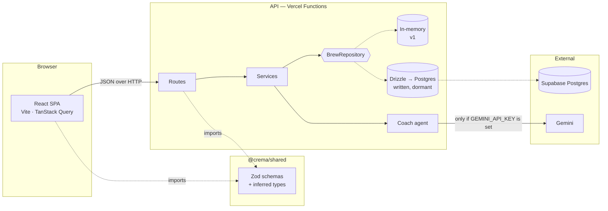
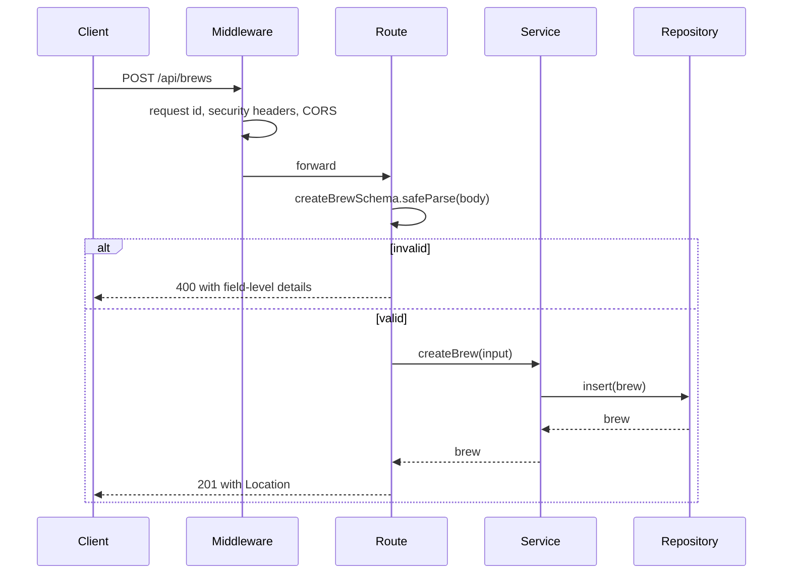

# Architecture

How Crema is put together, and why. Decisions and their alternatives are in
[PLANNING.md](../PLANNING.md); this describes the shape of what was built.

---

## System



Two things this diagram is making a point about.

`@crema/shared` is imported by both sides. One Zod schema per concept validates
the request body on the server and drives the form on the client, and the
TypeScript types are inferred from it rather than written twice. A change to the
contract breaks both sides in the same commit, so they cannot drift.

`BrewRepository` is an interface with two implementations. The in-memory one
runs today; the Drizzle one is written and tested against the same contract but
not activated. Switching is an environment variable, not a rewrite.

## Layering

```
route handler  →  service  →  repository  →  adapter
```

| Layer      | Knows about                            | Must not know about |
| ---------- | -------------------------------------- | ------------------- |
| Route      | HTTP, status codes, the shared schemas | Storage, SQL        |
| Service    | Business rules                         | Hono, HTTP, SQL     |
| Repository | The persistence contract               | Business rules      |
| Adapter    | Storage                                | Anything above it   |

Dependencies point inward and never back out. That is the whole reason the
storage adapter can be swapped without touching a route handler, and why the
service layer can be tested without a server or a database.

## Data model

```mermaid
erDiagram
    profiles ||--o{ brews : "owns"
    profiles ||--o{ ai_conversations : "owns"
    profiles ||--o{ ai_suggestions : "owns"
    brew_methods ||--o{ brews : "classifies"
    brews ||--o{ brew_flavor_tags : "tagged by"
    flavor_tags ||--o{ brew_flavor_tags : "applied to"
    ai_conversations ||--o{ ai_messages : "contains"
    ai_conversations ||--o{ ai_suggestions : "produced"
    brews |o--o| ai_suggestions : "accepted into"

    profiles {
        uuid id PK
        text display_name
        timestamptz created_at
        timestamptz updated_at
    }

    brew_methods {
        smallint id PK
        text slug UK
        text label
        smallint display_order
    }

    brews {
        uuid id PK
        uuid user_id FK
        text beans
        smallint method_id FK
        numeric coffee_grams
        numeric water_grams
        numeric brew_ratio "generated"
        smallint rating
        text tasting_notes
        timestamptz brewed_at
        timestamptz created_at
        timestamptz updated_at
        timestamptz deleted_at "soft delete"
    }

    flavor_tags {
        smallint id PK
        citext slug UK
        text label
    }

    brew_flavor_tags {
        uuid brew_id PK-FK
        smallint tag_id PK-FK
        enum source "human or ai"
        numeric confidence
    }

    ai_conversations {
        uuid id PK
        uuid user_id FK
        text title
    }

    ai_messages {
        uuid id PK
        uuid conversation_id FK
        enum role
        text content
        jsonb tool_calls
        integer prompt_tokens
        integer completion_tokens
    }

    ai_suggestions {
        uuid id PK
        uuid user_id FK
        uuid conversation_id FK
        jsonb payload
        enum status
        uuid brew_id FK
        timestamptz resolved_at
    }
```

### Decisions worth explaining

**Brew methods are a table, not a text column or an enum.** A foreign key makes
an invalid method unrepresentable. A `CHECK` against a hardcoded list only
approximates that and needs a migration every time a method is added. The
vocabulary also exists as a TypeScript constant so the API can return a `400`
with a useful message instead of a foreign key violation, and a test compares
the two so they cannot disagree.

**`brew_ratio` is a generated column.** It is derivable from the two columns
either side of it, so storing it is a denormalisation. It earns its place
because every list row and every coach question compares ratios, and a generated
column cannot drift from its inputs the way a trigger-maintained or
application-maintained one can. Postgres refuses to let anything write it.

**Deletes are soft.** `DELETE /api/brews/:id` sets `deleted_at`. An accidental
deletion is recoverable, and the AI suggestion audit trail keeps its foreign key
target. Every read path filters on `deleted_at IS NULL`, and a partial index
covers exactly those rows.

**Flavour tags carry provenance.** `source` records whether a human or the model
attached a tag, and `confidence` how sure the model was — null for human tags,
where the question does not arise. An AI-derived tag must never be
indistinguishable from one a person chose, because the user needs to know what
to trust.

**`ai_suggestions` is where the human-in-the-loop rule is enforced.** The agent
has no write path to `brews`. It writes a suggestion, the user accepts or
rejects it, and only an accepted one becomes a brew — with `brew_id` linking
back. Two constraints hold the rule: a suggestion is either pending and
unresolved or decided and resolved, and a `brew_id` may only exist on an
accepted row. It is a product decision expressed as a constraint, because
conventions are what get forgotten under deadline.

**Blank means "no non-whitespace character".** Written as
`column ~ '[^[:space:]]'` rather than `length(btrim(column)) > 0`, because
`btrim` strips spaces only — a single tab would pass that check while failing
the Zod `.trim().min(1)` on the same field. The database and the contract have
to agree about what blank means. This was found by a test, not by reading.

## Migrations

Ordered SQL in [`supabase/migrations/`](../supabase/migrations), applied in
filename order.

| File                    | Contents                                                             |
| ----------------------- | -------------------------------------------------------------------- |
| `0000_foundation.sql`   | `pgcrypto`, `citext`, the shared `set_updated_at()` trigger function |
| `0001_profiles.sql`     | Auth-ready profile table                                             |
| `0002_brew_methods.sql` | Lookup table and the seeded vocabulary                               |
| `0003_brews.sql`        | Core table, constraints, indexes, generated column, trigger          |
| `0004_flavor_tags.sql`  | Vocabulary and the brew join table                                   |
| `0005_ai.sql`           | Conversations, messages, suggestion audit trail                      |
| `0006_views.sql`        | `brew_stats`, `brew_stats_by_method`                                 |
| `0007_rls.sql`          | Row level security on every table                                    |

The SQL is the source of truth. `backend/src/db/schema.ts` mirrors its structure
so queries are typed, and a drift guard in CI applies the migrations to a real
Postgres and compares the result against those declarations — so the two files
cannot diverge without the build failing.

Reference data lives in the migrations, because `brews.method_id` points at it
and it is part of the schema contract. Demo content lives in
[`supabase/seed.sql`](../supabase/seed.sql) instead.

### Row level security, honestly

In v1 the browser never talks to Postgres. It calls the Crema API, which
connects with a role that bypasses row level security. So the policies in
`0007_rls.sql` are not currently what keeps anyone's brews private — the API is.

They are enabled anyway, because the moment anything connects with an anon key —
a Supabase client in the browser, a realtime subscription, an edge function — a
table without RLS is world-readable and the failure is silent. Turning it on
now, with no data to leak, costs nothing. Turning it on later means finding out
which production queries it breaks.

Supabase provides `auth.uid()`. Plain Postgres does not, so `0007_rls.sql`
creates a stand-in only when it is missing. The same migration therefore applies
unchanged to Supabase, to a local container, and to the CI service — and
Supabase's own implementation is never overwritten.

## Request lifecycle



Errors leave through one envelope, whatever threw them:

```json
{
  "error": {
    "code": "VALIDATION_FAILED",
    "message": "One or more fields are invalid.",
    "details": [
      { "field": "coffeeGrams", "message": "Must be greater than 0" }
    ],
    "requestId": "01J8X..."
  }
}
```

One shape means the client has one thing to parse and one thing to render, which
is why error handling stays small as the surface grows. The `requestId`
correlates a user's screenshot with a server log line. Unexpected errors are
logged in full and answered generically — a stack trace in a response is an
information leak, not a convenience.
